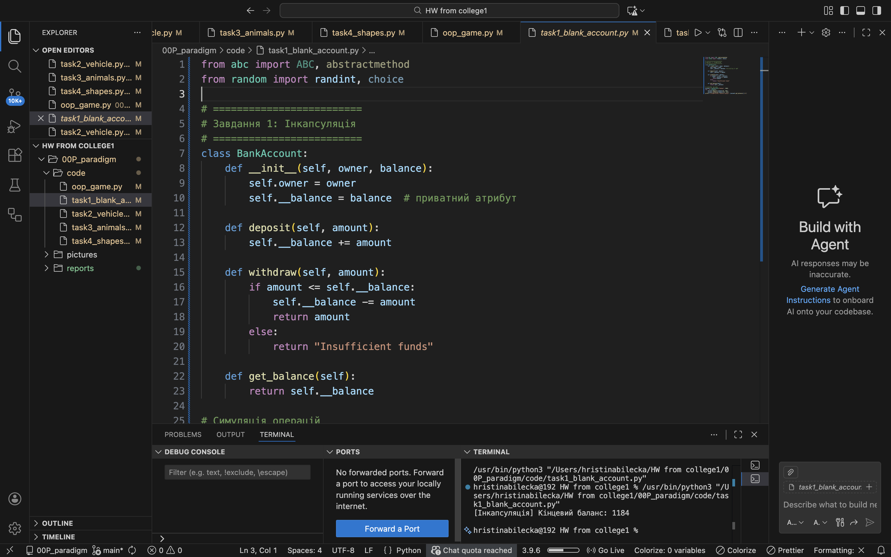
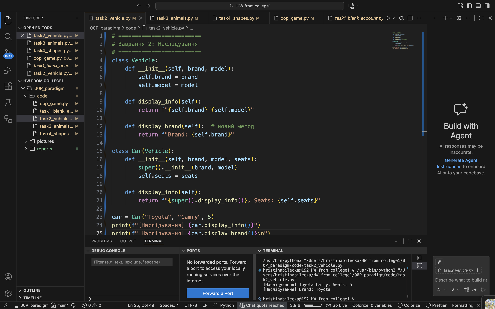
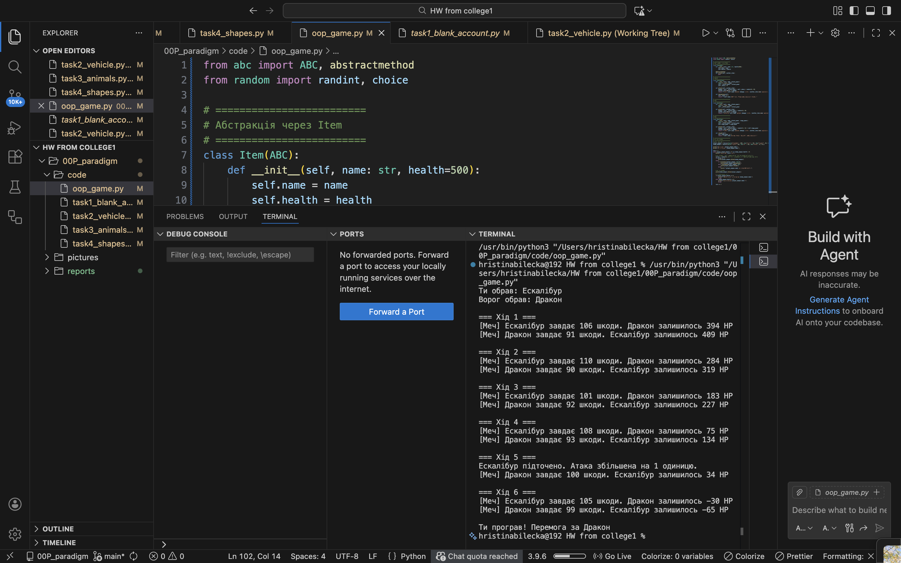

# Звіт до роботи: Основні парадигми ООП

Мета роботи: Ознайомитися з ключовими поняттями об’єктно-орієнтованого програмування (ООП) у Python та навчитися реалізовувати їх у власних класах на прикладі ігрової симуляції.

---

## Виконання роботи

### 1. Інкапсуляція
- Що зроблено: Створено клас BankAccount з публічним атрибутом owner та приватним __balance.
- Генератор випадкових чисел використано для викликів методів deposit() та withdraw() у циклі.
- Результат: Кінцевий баланс облікового запису виведено на екран.
- Код:
```python
from random import randint

class BankAccount:
    def __init__(self, owner, balance):
        self.owner = owner
        self.__balance = balance

    def deposit(self, amount):
        self.__balance += amount

    def withdraw(self, amount):
        if amount <= self.__balance:
            self.__balance -= amount
            return amount
        else:
            return "Insufficient funds"

    def get_balance(self):
        return self.__balance

account = BankAccount("Bohdan", 1000)
for _ in range(5):
    account.deposit(randint(100, 500))
    account.withdraw(randint(50, 400))
print(account.get_balance())

### 2. Наслідування
Що зроблено: Створено клас Vehicle та дочірній клас Car. Додано методи display_info() та display_brand().

class Vehicle:
    def __init__(self, brand, model):
        self.brand = brand
        self.model = model

    def display_info(self):
        return f"{self.brand} {self.model}"

    def display_brand(self):
        return f"Бренд: {self.brand}"

class Car(Vehicle):
    def __init__(self, brand, model, seats):
        super().__init__(brand, model)
        self.seats = seats

    def display_info(self):
        return f"{super().display_info()}, Seats: {self.seats}"

car = Car("Toyota", "Camry", 5)
print(car.display_info())
print(car.display_brand())

### 3. Поліморфізм

Що зроблено: Створено класи Dog, Cat, Fish. Метод speak() перевизначено для Dog та Cat. Fish без методу speak() викликає помилку.

Код: class Animal:
    def speak(self):
        pass

class Dog(Animal):
    def speak(self):
        return "Woof!"

class Cat(Animal):
    def speak(self):
        return "Meow!"

class Fish(Animal):
    pass

animals = [Dog(), Cat(), Fish()]
for animal in animals:
    try:
        print(animal.speak())
    except AttributeError:
        print(f"{animal.__class__.__name__} не має методу speak()")
        
4. Абстракція

Що зроблено: Створено абстрактний клас Item з методом attack(). Всі типи зброї (Sword, Axe, Bow) наслідують Item і реалізують attack(). Неможливо створити об’єкт Item напряму.

Код:

from abc import ABC, abstractmethod
from random import randint

class Item(ABC):
    def __init__(self, name, health=500):
        self.name = name
        self.health = health

    @abstractmethod
    def attack(self, another_item):
        pass
    
5. Ігрова симуляція

Що зроблено: Створено три типи зброї: Sword, Axe, Bow. Гра покрокова: користувач може атакувати або підсилювати зброю, ворог атакує автоматично. Демонструє всі парадигми ООП.
from abc import ABC, abstractmethod
from random import randint, choice

# =========================
# Абстракція через Item
# =========================
class Item(ABC):
    def __init__(self, name: str, health=500):
        self.name = name
        self.health = health

    @abstractmethod
    def attack(self, another_item):
        pass

# =========================
# Sword
# =========================
class Sword(Item):
    def __init__(self, name, attack_power):
        super().__init__(name)
        self.__attack_power = attack_power
        self._sharp = 0

    def attack(self, another_item):
        damage = self.__attack_power + self._sharp + randint(0, 10)
        another_item.health -= damage
        return f"[Меч] {self.name} завдає {damage} шкоди. {another_item.name} залишилось {another_item.health} HP"

    def sharpening(self):
        self._sharp += 1
        return f"{self.name} підточено. Атака збільшена на 1 одиницю."

# =========================
# Axe
# =========================
class Axe(Item):
    def __init__(self, name, attack_power):
        super().__init__(name)
        self.__attack_power = attack_power

    def attack(self, another_item):
        damage = self.__attack_power + randint(0, 20)
        another_item.health -= damage
        return f"[Сокира] {self.name} завдає {damage} шкоди. {another_item.name} залишилось {another_item.health} HP"

# =========================
# Bow
# =========================
class Bow(Item):
    def __init__(self, name, attack_power, range_power):
        super().__init__(name)
        self.__attack_power = attack_power
        self.range_power = range_power

    def attack(self, another_item):
        damage = self.__attack_power + randint(5, 15) + self.range_power
        another_item.health -= damage
        return f"[Лук] {self.name} завдає {damage} шкоди. {another_item.name} залишилось {another_item.health} HP"

    def reload(self):
        self.range_power += 1
        return f"{self.name} перезаряджено. Дальність збільшена на 1."

# =========================
# Ігрова логіка
# =========================
# Створюємо зброю
player_weapon = choice([Sword("Ескалібур", 100), Axe("Кратос", 95), Bow("Арбалет", 80, 10)])
enemy_weapon = choice([Sword("Дракон", 90), Axe("Тор", 85), Bow("Сокіл", 75, 12)])

print(f"Ти обрав: {player_weapon.name}")
print(f"Ворог обрав: {enemy_weapon.name}")

turn = 1
while player_weapon.health > 0 and enemy_weapon.health > 0:
    print(f"\n=== Хід {turn} ===")
    
    # Користувач робить випадкову дію (для прикладу автоматично)
    action = randint(1, 2)  # 1 - атакувати, 2 - підсилити/перезарядити
    if action == 1:
        print(player_weapon.attack(enemy_weapon))
    else:
        if isinstance(player_weapon, Sword):
            print(player_weapon.sharpening())
        elif isinstance(player_weapon, Bow):
            print(player_weapon.reload())
        else:
            print(f"{player_weapon.name} не можна підсилити.")

    # Ворог атакує
    print(enemy_weapon.attack(player_weapon))

    # Перевірка здоров'я
    if player_weapon.health <= 0:
        print(f"\nТи програв! Перемога за {enemy_weapon.name}")
        break
    elif enemy_weapon.health <= 0:
        print(f"\nПеремога за {player_weapon.name}!")
        break

    turn += 1
    

## Висновок
 • Усі парадигми ООП реалізовані: інкапсуляція, наслідування, поліморфізм, абстракція.
 • Мета роботи досягнута.
 • Отримані знання: організація програм через класи, застосування абстрактних класів, перевизначення методів, робота з приватними атрибутами.
 • Усі завдання виконані; складності були з Bow та покроковою логікою, але їх вирішено.
 • Формат здачі зручний; побажання: більше інтерактивних прикладів.
